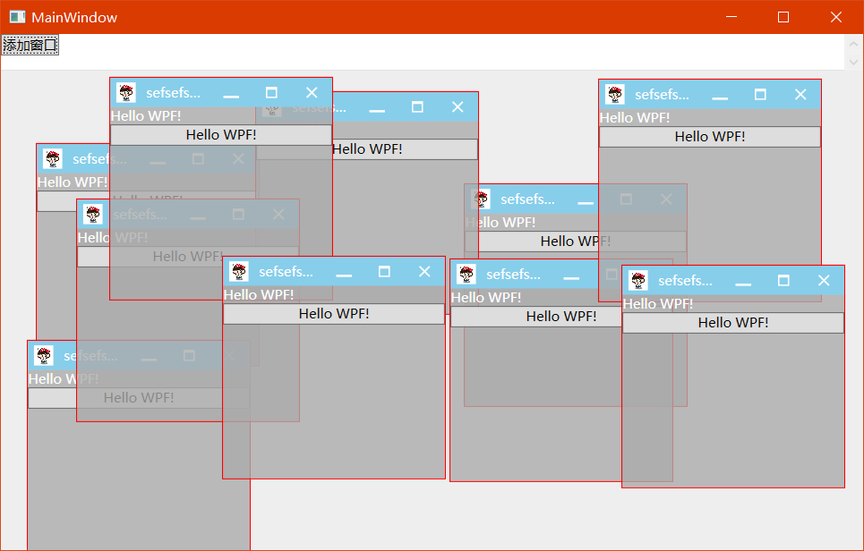

# T.WPF.Controls(devloping)

wpf 的控件集合，主要是对 wpf 原生控件的扩展，加入非常常用的控件。
开发的计划如下：

- [x] ColorPicker(will finish)
- [ ] PropertyGrid
- [ ] ScrollTabControl
- [ ] Dialog inner window
- [ ] TimePicker

### ColorPicker

### ChildWindow

